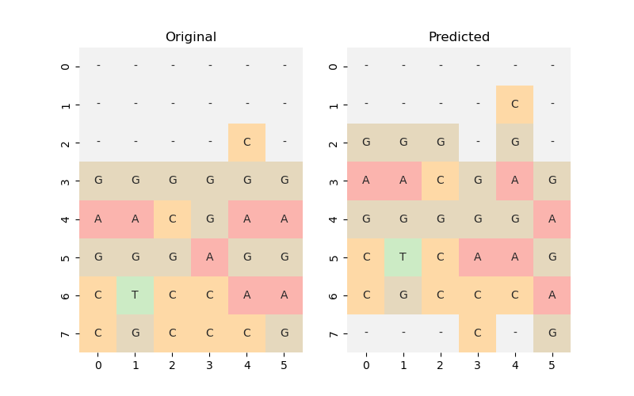

Playing-the-system
==============================

This repository represents the code that is described our project for extracting player strategies in Borderland Science, an online science discovery game, which, in its turn, includes a multi-sequence alignment game. We approached this task with Behavioural Cloning. Previous research has largely focused on classical Reinforcement Learning (RL) methods and missed the opportunity to use the real experience of people, which often surpasses existing methods of multiple sequence alignments. Our results show that these approach can match human performance by learning basic dynamics and rules.

[](https://github.com/renata-nerenata/Playing-the-system/actions)
[](https://codeclimate.com/github/renata-nerenata/Playing-the-system/test_coverage)


Project Organization
------------

    ├── LICENSE
    ├── Makefile           <- Makefile with commands like `make data` or `make train`
    ├── README.md          <- The top-level README for developers using this project.
    ├── data
    │   ├── external       <- Data from third party sources.
    │   ├── interim        <- Intermediate data that has been transformed.
    │   ├── processed      <- The final, canonical data sets for modeling.
    │   └── raw            <- The original, immutable data dump.
    │
    ├── docs               <- A default Sphinx project; see sphinx-doc.org for details
    │
    ├── models             <- Trained and serialized models, model predictions, or model summaries
    │
    ├── notebooks          <- Jupyter notebooks. Naming convention is a number (for ordering),
    │                         the creator's initials, and a short `-` delimited description, e.g.
    │                         `1.0-jqp-initial-data-exploration`.
    │
    ├── references         <- Data dictionaries, manuals, and all other explanatory materials.
    │
    ├── reports            <- Generated analysis as HTML, PDF, LaTeX, etc.
    │   └── figures        <- Generated graphics and figures to be used in reporting
    │
    ├── requirements.txt   <- The requirements file for reproducing the analysis environment, e.g.
    │                         generated with `pip freeze > requirements.txt`
    │
    ├── setup.py           <- makes project pip installable (pip install -e .) so src can be imported
    ├── src                <- Source code for use in this project.
    │   ├── __init__.py    <- Makes src a Python module
    │   │
    │   ├── data           <- Scripts to download or generate data
    │   │   └── make_dataset.py
    │   │
    │   ├── features       <- Scripts to turn raw data into features for modeling
    │   │   └── build_features.py
    │   │
    │   ├── models         <- Scripts to train models and then use trained models to make
    │   │   │                 predictions
    │   │   ├── predict_model.py
    │   │   └── train_model.py
    │   │
    │   └── visualization  <- Scripts to create exploratory and results oriented visualizations
    │       └── visualize.py
    │
    └── tox.ini            <- tox file with settings for running tox; see tox.readthedocs.io


--------

## Pre-trained models

```console
python inference.py --model <model_type> --puzzle <puzzle> --accepted_pairs <accepted_pairs> --steps <used_gaps>
```
[](https://asciinema.org/a/EJjTG7Fc5tDwpe5ouZSXEeESA)

### Example:
